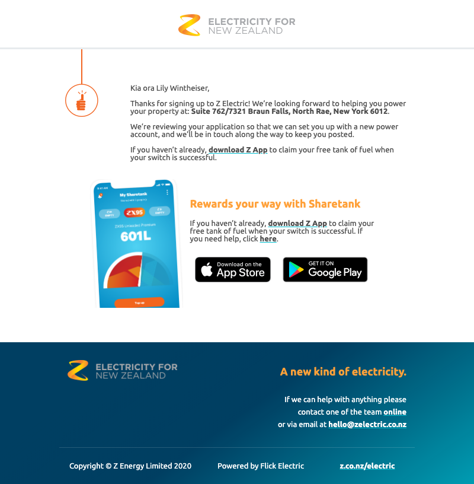

### Electric emails
#### Install

run ```yarn```

#### Dev

run ```yarn dev```

This does a few things
- Starts a process to watch and compile `./mjml` templates to `./liquid` templates
- Opens sign_up_confirmation liquid template as html in the browser
	- TODO live reload?

#### Test

run ```jest```

Renders the emails, and performs a visual regression

Screenshots and differences are rendered under `test/__image_snapshots__`

#### Preview


